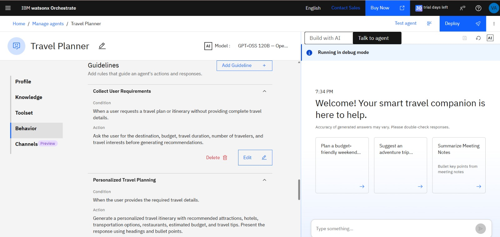
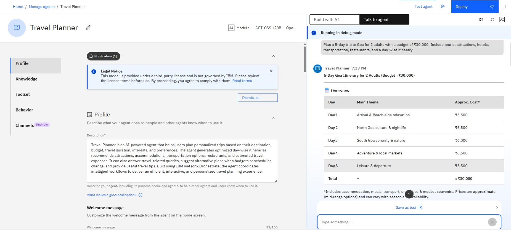
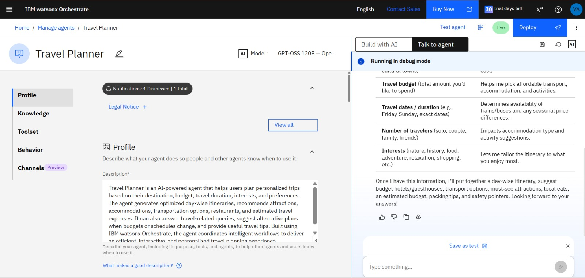
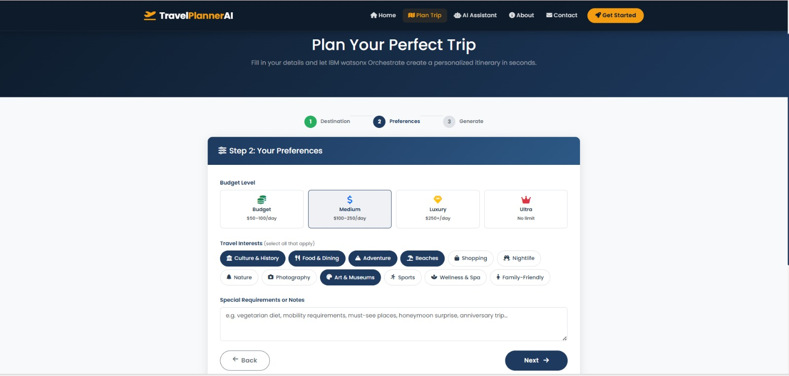

# TravelPlannerAI ✈️

**AI-Powered Travel Planning with IBM watsonx Orchestrate**

[](https://python.org)
[](https://flask.palletsprojects.com)
[](https://www.ibm.com/products/watsonx-orchestrate)
[](https://getbootstrap.com)

A full-stack AI-powered travel planning web application that uses an embedded **IBM watsonx Orchestrate** agent to power the chat assistant, alongside a structured itinerary engine for day-wise travel planning.

---

## 🎓 Internship Final Project

This project was developed as the capstone project for the **Edunet Foundation Internship on Emerging Technologies (AI & Cloud)**, conducted in collaboration with **IBM SkillsBuild**, **IBM Cloud**, and **AICTE**.

The AI Travel Planner leverages **IBM watsonx Orchestrate** to deliver personalized travel planning through an intelligent conversational assistant. The application features a responsive Flask-based web interface that enables users to generate customized itineraries, receive destination recommendations, estimate travel budgets, explore tourist attractions, and access essential travel information, providing a complete AI-powered travel planning experience.

---

## 🌟 Features

| Feature | Description |
|---|---|
| 🤖 **AI Itinerary Generation** | Day-by-day structured itinerary plans |
| 💬 **AI Chat Assistant** | Live IBM watsonx Orchestrate embedded agent |
| 🏨 **Hotel Recommendations** | Budget-matched hotel suggestions |
| 🍽️ **Restaurant Picks** | Local dining and street food gems |
| 🚌 **Transport Guide** | Getting there + local transit info |
| 💰 **Budget Breakdown** | Detailed cost estimates by category |
| 🧳 **Packing Checklist** | Smart AI-generated packing list |
| 🛡️ **Safety Tips** | Destination-specific safety advice |
| 📄 **PDF Export** | Download full itinerary as PDF |
| 🔐 **Auth System** | Login / Signup (session-based) |
| 📱 **Responsive Design** | Mobile-first Bootstrap 5 UI |

---

## 🏗️ Project Structure

```
TravelPlannerAI/
├── app.py                  # Flask application & routes
├── watsonx_ai.py           # Itinerary/destination helpers (no SDK needed)
├── requirements.txt        # Python dependencies
├── .env.example            # Environment variables template
├── README.md               # This file
│
├── templates/              # Jinja2 HTML templates
│   ├── base.html           # Base layout (navbar, footer)
│   ├── index.html          # Landing page
│   ├── auth.html           # Login / Signup (shared)
│   ├── plan.html           # 3-step trip planning form
│   ├── itinerary.html      # Generated itinerary view
│   ├── chatbot.html        # AI chat assistant
│   ├── about.html          # About page
│   ├── contact.html        # Contact + FAQ
│   ├── 404.html            # 404 error page
│   └── 500.html            # 500 error page
│
└── static/
    ├── css/
    │   └── style.css       # Custom stylesheet
    └── js/
        └── main.js         # Client-side JavaScript
```

---

## 🚀 Quick Start

### 1. Clone the repository

```bash
git clone https://github.com/yourname/TravelPlannerAI.git
cd TravelPlannerAI
```

### 2. Create a virtual environment

```bash
python -m venv venv
# Windows
venv\Scripts\activate
# macOS/Linux
source venv/bin/activate
```

### 3. Install dependencies

```bash
pip install -r requirements.txt
```

### 4. Configure environment variables

```bash
cp .env.example .env
```

Edit `.env`:

```env
FLASK_SECRET_KEY=your-super-secret-flask-key
APP_NAME=TravelPlannerAI
```

> No `WATSONX_PROJECT_ID` or watsonx.ai SDK credentials are needed.
> The AI chat is handled entirely by the embedded IBM watsonx Orchestrate widget.

### 5. Run the application

```bash
python app.py
```

Open your browser at **http://localhost:5000**

---

## 🔑 IBM watsonx Orchestrate Setup

The chat assistant is powered by a deployed IBM watsonx Orchestrate agent embedded via the `wxoLoader` script.
No additional IBM Cloud API keys or Project IDs are required for the chat to work.

The embed configuration (in [`templates/chatbot.html`](templates/chatbot.html) and [`templates/index.html`](templates/index.html)) points directly to your deployed agent:

```js
window.wxOConfiguration = {
  orchestrationID: "...",
  hostURL: "https://eu-gb.watson-orchestrate.cloud.ibm.com",
  rootElementID: "root",
  deploymentPlatform: "ibmcloud",
  crn: "crn:v1:bluemix:public:watsonx-orchestrate:...",
  chatOptions: { agentId: "..." }
};
```

---

## 🌐 API Endpoints

| Method | Endpoint | Description |
|---|---|---|
| `GET` | `/` | Landing page |
| `GET` | `/plan` | Trip planning form |
| `GET/POST` | `/login` | Login page |
| `GET/POST` | `/signup` | Signup page |
| `GET` | `/logout` | Logout |
| `GET` | `/itinerary` | View generated itinerary |
| `GET` | `/chatbot` | AI chat assistant |
| `GET` | `/about` | About page |
| `GET/POST` | `/contact` | Contact page |
| `POST` | `/api/generate-itinerary` | **Generate itinerary** |
| `POST` | `/api/destination-info` | **Destination highlights** |
| `POST` | `/api/download-pdf` | **Download itinerary PDF** |

---

## 📖 API Usage Examples

### Generate Itinerary

```bash
curl -X POST http://localhost:5000/api/generate-itinerary \
  -H "Content-Type: application/json" \
  -d '{
    "destination": "Paris, France",
    "start_date": "2025-06-01",
    "end_date": "2025-06-07",
    "budget": "medium",
    "travelers": 2,
    "preferences": ["cultural", "food", "art"]
  }'
```

---

## 🎨 Tech Stack

| Layer | Technology |
|---|---|
| AI Chat | IBM watsonx Orchestrate (embedded widget) |
| Backend | Python 3.10+, Flask 3.0 |
| Frontend | HTML5, CSS3, Bootstrap 5.3, Font Awesome 6 |
| JavaScript | Vanilla JS (ES6+) |
| PDF Generation | ReportLab |
| Session | Flask-Session |
| Env Config | python-dotenv |

---

## 🛠️ Development

### Demo Mode (No IBM Credentials)

The app runs in **demo mode** without IBM credentials — mock responses are returned so you can explore the full UI without an IBM account.

### Production Deployment

```bash
# With Gunicorn
gunicorn -w 4 -b 0.0.0.0:5000 app:app

# Or with Docker
docker build -t travelplannerai .
docker run -p 5000:5000 --env-file .env travelplannerai
```

---

## 📄 License

MIT License — free to use, modify, and distribute.

---

## 🤝 Contributing

1. Fork the repo
2. Create a feature branch (`git checkout -b feature/amazing-feature`)
3. Commit changes (`git commit -m 'Add amazing feature'`)
4. Push to branch (`git push origin feature/amazing-feature`)
5. Open a Pull Request

---

---

# 📸 Project Screenshots

This section showcases the complete workflow of the **AI Travel Planner** developed using **IBM watsonx Orchestrate**, from agent creation to itinerary generation and frontend implementation.

---

## 🏠 Home Page

The landing page of the AI Travel Planner website, providing users with an intuitive interface to start planning their trips.


---

## 🤖 IBM watsonx Orchestrate Travel Planner Agent

The AI Travel Planner agent created and configured using IBM watsonx Orchestrate.


---

## 📋 Agent Guidelines

Custom instructions and behavioral guidelines configured for the AI Travel Planner to provide accurate and personalized travel recommendations.



---

## 💬 Testing the AI Travel Planner Agent

Testing the deployed IBM watsonx Orchestrate Travel Planner by providing user travel queries and verifying AI-generated responses.



---

## 🚀 Live Deployment

The Travel Planner agent successfully deployed and running in Live mode on IBM watsonx Orchestrate.



---

## 📍 Step 1 – Travel Details

Users enter their destination, travel dates, and trip duration to begin planning their personalized itinerary.


---

## ❤️ Step 2 – Travel Preferences

Users choose their travel interests and preferences, allowing the AI to generate customized recommendations.



---

---

## ✅ Step 3 – Review & Generate

Users review all the entered travel details before generating a personalized AI-powered itinerary.


---

## 🗺️ Destination Overview

The generated itinerary provides a detailed overview of the destination, including popular attractions, recommended activities, travel tips, estimated expenses, and suggested accommodations.


---

**Built with ❤️ using IBM watsonx Orchestrate**